# Inventory SaaS Software Architecture Handbook

## 1. High-Level Architecture

Inventory SaaS is a web-based inventory management and point-of-sale platform built on Next.js. It is structured as a layered application with a browser-facing frontend, a server-side API layer, a business logic service layer, and a MongoDB persistence layer.

At a high level, the system follows a conventional request-driven architecture:

- A user interacts with a React-based interface.
- The UI calls Next.js route handlers through HTTP.
- Route handlers authenticate the request and delegate work to service modules.
- Services encapsulate inventory, order, authentication, and reporting business rules.
- MongoDB stores the domain entities and transactional state.

### Architectural style
- Web application framework: Next.js App Router
- UI model: React components with client-side state
- API model: REST-style route handlers
- Persistence model: MongoDB with Mongoose ODM
- Security model: JWT in an HTTP-only cookie
- Deployment model: stateless application servers with shared MongoDB persistence

### Core architectural principles
- Separate presentation, API, service, and persistence concerns.
- Centralize shared infrastructure such as authentication, validation, and response formatting.
- Keep business rules in services rather than route handlers.
- Favor clear domain flows over framework-specific complexity.

### System context diagram

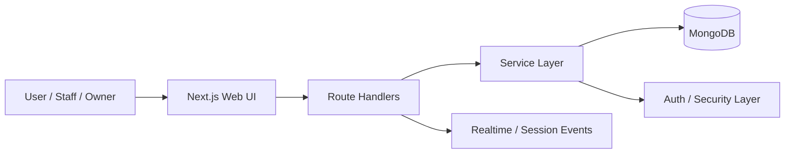
```mermaid
flowchart LR
    User[User / Staff / Owner] --> UI[Next.js Web UI]
    UI --> API[Route Handlers]
    API --> Services[Service Layer]
    Services --> DB[(MongoDB)]
    Services --> Auth[Auth / Security Layer]
    API --> Events[Realtime / Session Events]
```

---

## 2. System Components

The system is composed of the following major runtime components:

### Presentation layer
Responsible for the user experience and page rendering.
- Authentication pages
- Dashboard and analytics views
- Product catalog and category management
- Orders and POS screens
- Settings and configuration pages

### API layer
Responsible for request handling and orchestration.
- Auth endpoints
- Product and category endpoints
- Orders and returns endpoints
- Sessions and barcode endpoints
- Dashboard and reports endpoints

### Service layer
Responsible for domain operations and workflow orchestration.
- Authentication services
- Product catalog services
- Order lifecycle services
- Inventory and barcode services
- Reporting services
- Session services

### Data layer
Responsible for persistence and model semantics.
- MongoDB collections for users, products, orders, sessions, barcodes, settings, and resets
- Mongoose schema definitions and relationships

### Infrastructure layer
Responsible for cross-cutting concerns.
- Authentication cookies and JWT helpers
- Validation and parsing utilities
- Error normalization and response formatting
- Database connection pooling and caching

---

## 3. Module Breakdown

### 1. Authentication and identity
Covers login, signup, password reset, token issuance, and session identity.
- User registration and login
- Password hashing and verification
- JWT signing and validation
- Auth cookie lifecycle

### 2. Catalog management
Covers products and categories.
- Create, update, delete, and list products
- Product search and filtering
- Category creation and association
- Catalog analytics

### 3. Inventory and barcode operations
Covers inventory mutation and barcode lifecycle.
- Barcode creation and ownership assignment
- Stock reservation and release
- Sell and return operations
- Barcode-driven POS behavior

### 4. Order lifecycle
Covers order intake, approval, cancellation, and returns.
- Draft and pending state transitions
- Approval workflows
- Inventory adjustment on approve/cancel/return
- Order reporting and status visibility

### 5. Sessions and billing workflows
Covers temporary billing sessions and cart-style operations.
- Session creation and join flows
- QR-based participation
- Cart item accumulation
- Completion and cancellation

### 6. Reporting and analytics
Covers dashboard and summary metrics.
- Inventory summary
- Sales overview
- Reporting by category and order state

### 7. Settings and configuration
Covers tenant-level configuration values.
- Store settings
- Billing-related settings
- System behavior preferences

---

## 4. Folder Responsibilities

### [src/app](src/app)
The main application entry point containing routes, components, services, and shared libraries.

### [src/app/api](src/app/api)
Contains all HTTP route handlers. This is the boundary between the frontend and backend logic.

### [src/app/components](src/app/components)
Contains reusable UI building blocks such as auth forms, layout shells, dashboards, and scanners.

### [src/app/lib](src/app/lib)
Contains cross-cutting infrastructure modules including database access, security helpers, validation, parsing, and response shaping.

### [src/app/models](src/app/models)
Contains Mongoose schema definitions and persistence models.

### [src/app/services](src/app/services)
Contains the domain logic that governs business operations.

### [src/app/(auth)](src/app/(auth))
Contains authentication-facing views and flows.

### [src/app/products](src/app/products), [src/app/orders](src/app/orders), [src/app/pos](src/app/pos), [src/app/reports](src/app/reports), [src/app/settings](src/app/settings)
Contain feature-specific UI routes for primary business operations.

### [tests](tests)
Contains Playwright-based API and UI automation tests.

---

## 5. Request Lifecycle

A request in this system generally follows this lifecycle:

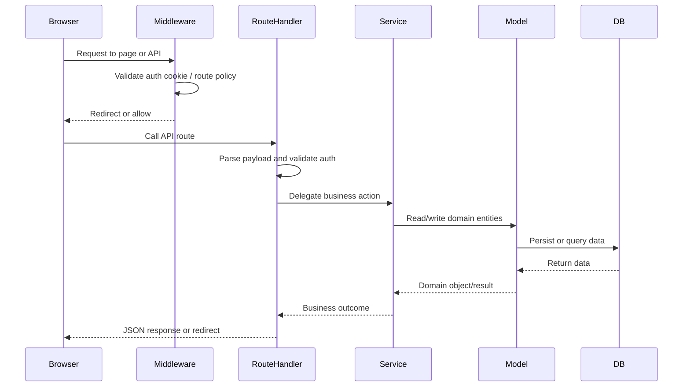
```mermaid
sequenceDiagram
    participant Browser
    participant Middleware
    participant RouteHandler
    participant Service
    participant Model
    participant DB

    Browser->>Middleware: Request to page or API
    Middleware->>Middleware: Validate auth cookie / route policy
    Middleware-->>Browser: Redirect or allow
    Browser->>RouteHandler: Call API route
    RouteHandler->>RouteHandler: Parse payload and validate auth
    RouteHandler->>Service: Delegate business action
    Service->>Model: Read/write domain entities
    Model->>DB: Persist or query data
    DB-->>Model: Return data
    Model-->>Service: Domain object/result
    Service-->>RouteHandler: Business outcome
    RouteHandler-->>Browser: JSON response or redirect
```

### Request handling pattern
1. Edge middleware checks whether the request is protected.
2. Route handlers parse the input and enforce basic request context.
3. Services execute the internal business workflow.
4. Mongoose persists or queries the required records.
5. A structured response is returned to the client.

---

## 6. Authentication Architecture

### Authentication mechanism
The system uses JWT-based authentication stored in an HTTP-only cookie named inventory_saas_token.

### Authentication flow
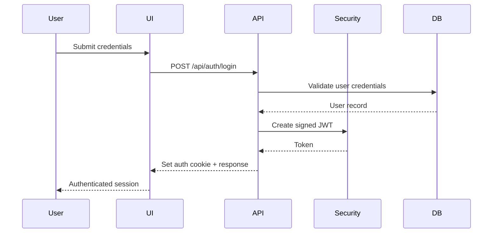
```mermaid
sequenceDiagram
    participant User
    participant UI
    participant API
    participant Security
    participant DB

    User->>UI: Submit credentials
    UI->>API: POST /api/auth/login
    API->>DB: Validate user credentials
    DB-->>API: User record
    API->>Security: Create signed JWT
    Security-->>API: Token
    API-->>UI: Set auth cookie + response
    UI-->>User: Authenticated session
```

### Security characteristics
- JWTs are signed with a server-side secret.
- The cookie is marked HTTP-only and same-site constrained.
- Protected routes are blocked by middleware before reaching application logic.
- Auth payload includes identity and role details.

### Authentication concerns
- The current authentication model is simple and serviceable for a small-to-medium SaaS application.
- The design should eventually harden around secret management, rotation, and stronger authorization checks.

---

## 7. Authorization Architecture

### Current authorization model
Authorization is currently role-aware but relatively simple.
- Owner-level actions are privileged.
- Staff-level access is allowed for routine operations.
- Some endpoints rely on a basic ownership or role check rather than a richer policy engine.

### Authorization pattern
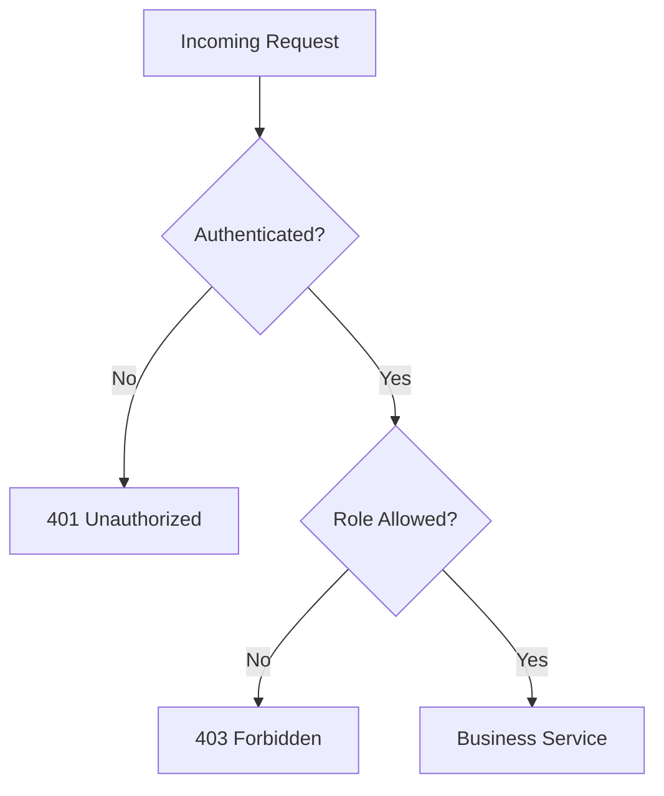
```mermaid
flowchart TD
    Request[Incoming Request] --> AuthCheck{Authenticated?}
    AuthCheck -->|No| Reject[401 Unauthorized]
    AuthCheck -->|Yes| RoleCheck{Role Allowed?}
    RoleCheck -->|No| Deny[403 Forbidden]
    RoleCheck -->|Yes| Service[Business Service]
```

### Authorization design observations
- Middleware provides coarse route-level protection.
- Route handlers and services enforce the business-specific access rules.
- Authorization is functional but should be elevated into a more explicit policy layer as the platform grows.

### Recommended direction
- Introduce policy-based authorization with clearer boundaries between owner, staff, and tenant administrator roles.
- Centralize permission evaluation instead of repeating inline checks across routes.

---

## 8. Database Architecture

### Database choice
MongoDB is the system’s primary store. The application uses Mongoose for schema modeling and document interaction.

### Data model approach
The system uses a document-oriented model with user-scoped collections. Each business domain is represented as a collection with a user identifier for multi-tenant-like isolation.

### Core collections
- Users
- Products
- Categories
- Orders
- Barcodes
- Sessions
- Settings
- Password reset records
- Returns

### Data architecture characteristics
- Schemas are relatively document-centric and straightforward.
- Some entities have embedded lists and state values that are appropriate for current scale.
- Inventory and transactional state are sensitive and should be treated carefully as the system grows.

### Persistence design considerations
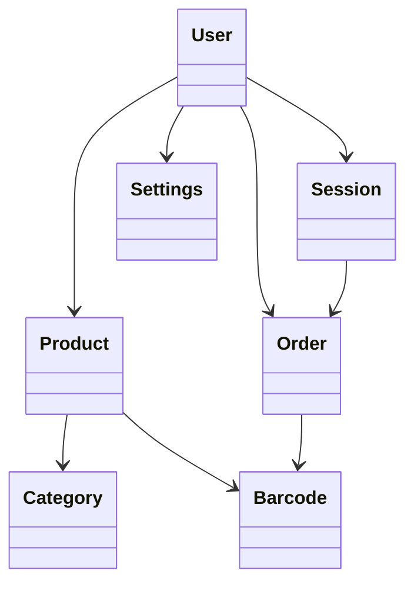
```mermaid
classDiagram
    class User
    class Product
    class Category
    class Order
    class Barcode
    class Session
    class Settings

    User --> Product
    User --> Order
    User --> Session
    User --> Settings
    Product --> Category
    Product --> Barcode
    Order --> Barcode
    Session --> Order
```

### Database concerns
- The data model is suitable for a small-to-medium SaaS product.
- Stronger indexing and lifecycle management will be required as order volume and inventory size increase.

---

## 9. API Architecture

### API style
The application exposes REST-style endpoints using Next.js route handlers.

### API responsibilities
- Receive and validate input
- Enforce authentication and basic authorization
- Delegate to service modules
- Return standardized success or error responses

### API domains
- Auth APIs
- Catalog APIs
- Order APIs
- Session APIs
- Report APIs
- Settings APIs
- Barcode APIs

### API architecture shape
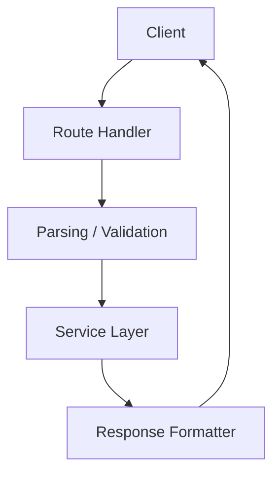
```mermaid
flowchart TB
    Client[Client] --> Route[Route Handler]
    Route --> Validation[Parsing / Validation]
    Validation --> Service[Service Layer]
    Service --> Response[Response Formatter]
    Response --> Client
```

### API design observations
- The architecture is simple and easy to reason about.
- However, the route layer could be more standardized to reduce duplication and ensure every write path uses the same validation and error-handling pipeline.

---

## 10. Frontend Architecture

### Frontend framework
The frontend is built with React and Next.js App Router. The UI uses route-based pages and reusable components.

### Frontend responsibilities
- Render domain pages and forms
- Manage local UI state for filtering, editing, and interaction
- Call backend APIs
- Present workflow feedback and errors

### Frontend composition model
- Feature pages coordinate domain-specific UI behavior.
- Shared components provide reusable layout and interaction primitives.
- Some components are large and contain multiple responsibilities, which is a maintainability concern.

### Frontend architecture view
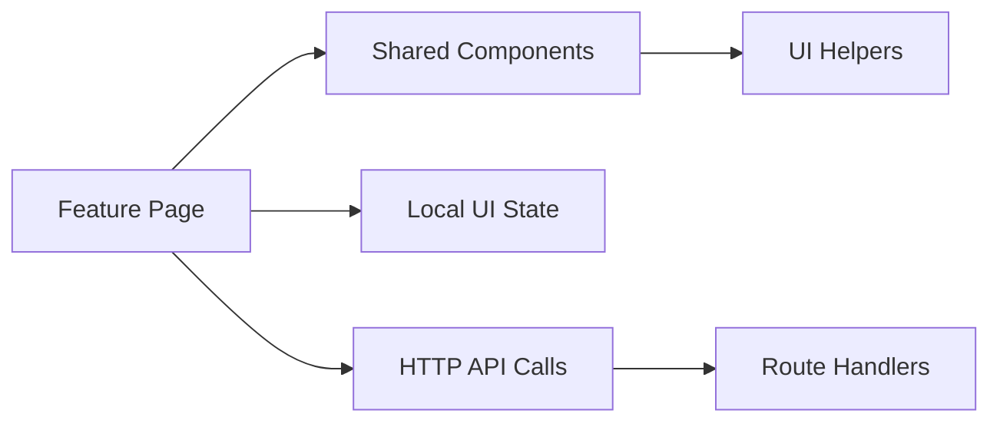
```mermaid
flowchart LR
    Page[Feature Page] --> Component[Shared Components]
    Page --> State[Local UI State]
    Page --> API[HTTP API Calls]
    Component --> Icons[UI Helpers]
    API --> Backend[Route Handlers]
```

### Frontend concerns
- The UI is functional and coherent, but the largest screens have grown into large stateful components.
- A structure based on feature modules and hooks would increase maintainability.

---

## 11. Service Layer Architecture

The service layer is the heart of the business logic. It isolates the application from direct persistence concerns and centralizes domain behavior.

### Service layer purpose
- Enforce business rules
- Coordinate multiple data operations
- Manage inventory state transitions
- Hide persistence details from routes and UI

### Core service domains
- Authentication service
- Product service
- Category service
- Order service
- Session service
- Report service
- Settings service
- Barcode service

### Service architecture pattern
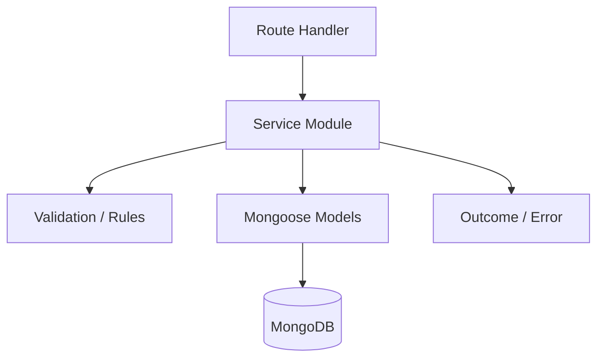
```mermaid
flowchart TD
    Route[Route Handler] --> Service[Service Module]
    Service --> Validation[Validation / Rules]
    Service --> Models[Mongoose Models]
    Models --> DB[(MongoDB)]
    Service --> Response[Outcome / Error]
```

### Service layer observations
- The service layer is the most important architectural boundary in the codebase.
- It should continue to absorb business logic and avoid letting route handlers become business entities.

---

## 12. Dependency Graphs

### Runtime dependency graph
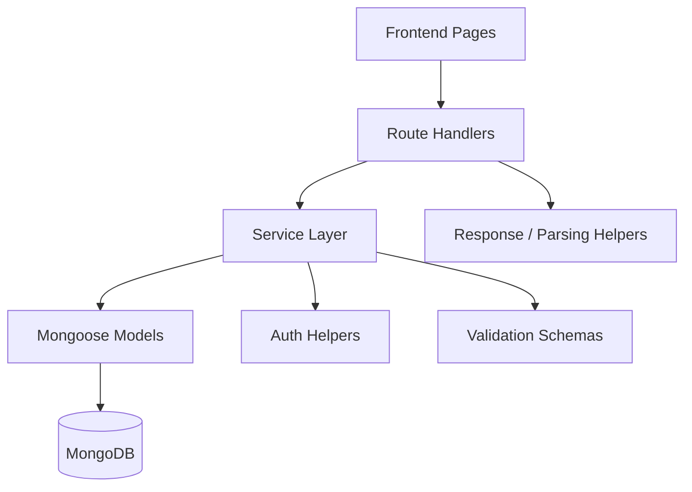
```mermaid
flowchart TD
    UI[Frontend Pages] --> API[Route Handlers]
    API --> Services[Service Layer]
    Services --> Models[Mongoose Models]
    Models --> DB[(MongoDB)]
    Services --> Security[Auth Helpers]
    Services --> Validation[Validation Schemas]
    API --> Helpers[Response / Parsing Helpers]
```

### Feature dependency graph
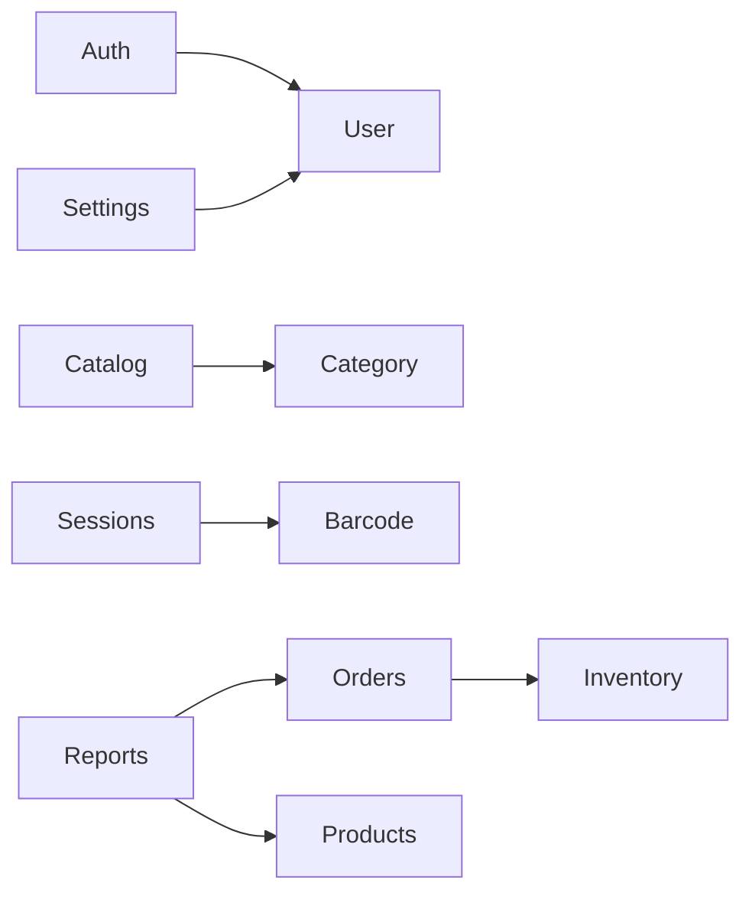
```mermaid
flowchart LR
    Auth --> User
    Catalog --> Category
    Orders --> Inventory
    Sessions --> Barcode
    Reports --> Orders
    Reports --> Products
    Settings --> User
```

---

## 13. Sequence Diagrams

### Login sequence
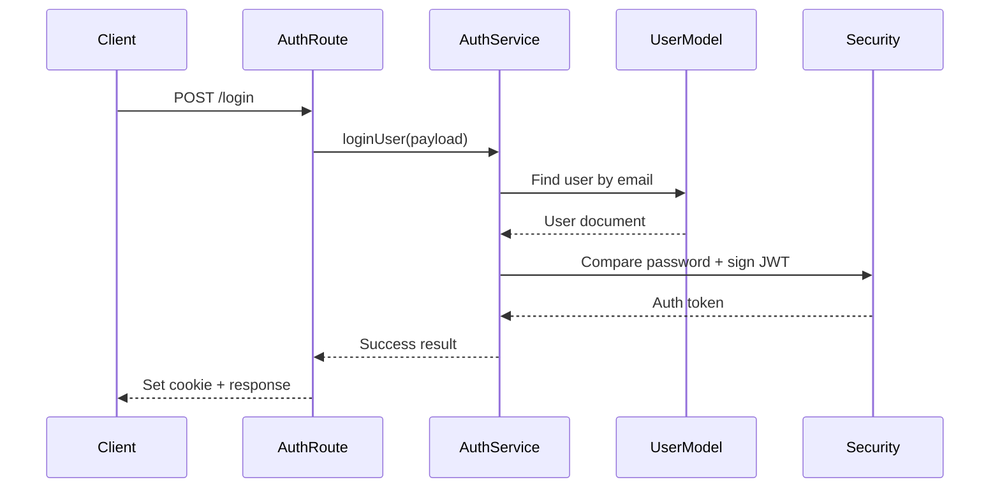
```mermaid
sequenceDiagram
    participant Client
    participant AuthRoute
    participant AuthService
    participant UserModel
    participant Security

    Client->>AuthRoute: POST /login
    AuthRoute->>AuthService: loginUser(payload)
    AuthService->>UserModel: Find user by email
    UserModel-->>AuthService: User document
    AuthService->>Security: Compare password + sign JWT
    Security-->>AuthService: Auth token
    AuthService-->>AuthRoute: Success result
    AuthRoute-->>Client: Set cookie + response
```

### Order approval sequence
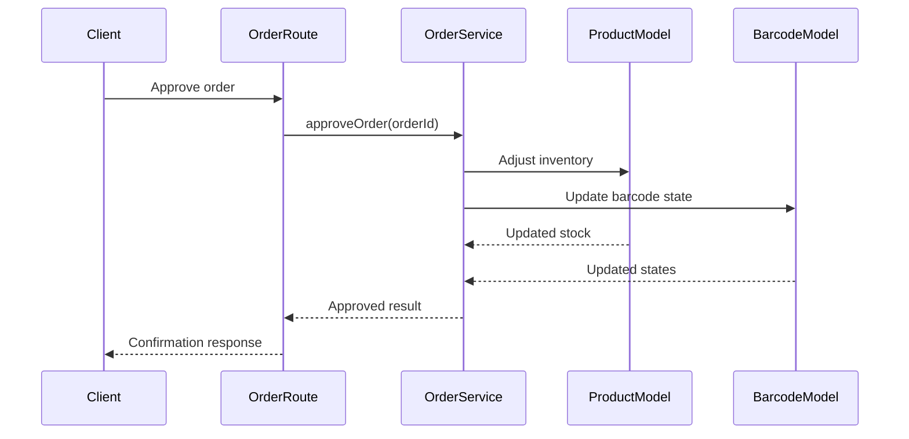
```mermaid
sequenceDiagram
    participant Client
    participant OrderRoute
    participant OrderService
    participant ProductModel
    participant BarcodeModel

    Client->>OrderRoute: Approve order
    OrderRoute->>OrderService: approveOrder(orderId)
    OrderService->>ProductModel: Adjust inventory
    OrderService->>BarcodeModel: Update barcode state
    ProductModel-->>OrderService: Updated stock
    BarcodeModel-->>OrderService: Updated states
    OrderService-->>OrderRoute: Approved result
    OrderRoute-->>Client: Confirmation response
```

---

## 14. Component Diagrams

### Logical component view
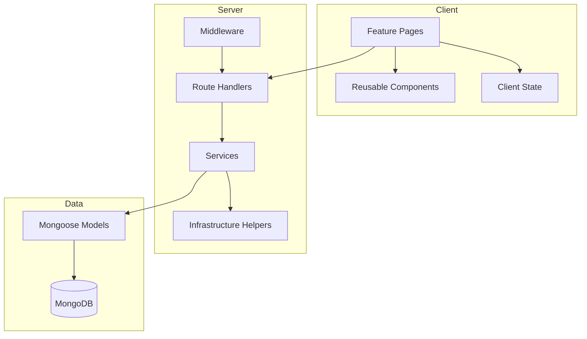
```mermaid
flowchart TB
    subgraph Client
        Pages[Feature Pages]
        Components[Reusable Components]
        State[Client State]
    end

    subgraph Server
        Middleware[Middleware]
        Routes[Route Handlers]
        Services[Services]
        Helpers[Infrastructure Helpers]
    end

    subgraph Data
        Models[Mongoose Models]
        DB[(MongoDB)]
    end

    Pages --> Components
    Pages --> State
    Pages --> Routes
    Middleware --> Routes
    Routes --> Services
    Services --> Helpers
    Services --> Models
    Models --> DB
```

---

## 15. Data Flow Diagrams

### Product creation flow
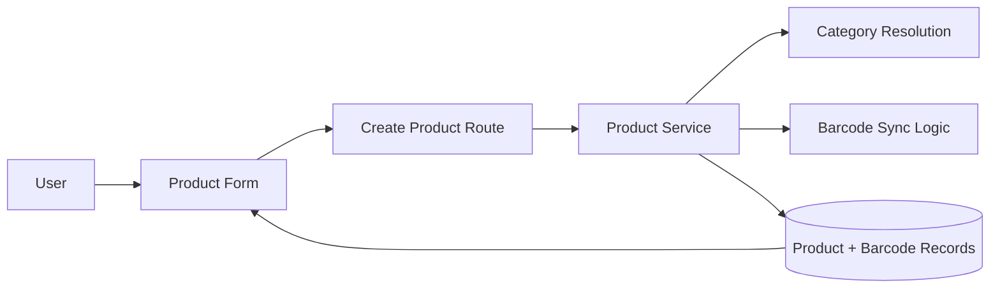
```mermaid
flowchart LR
    User[User] --> UI[Product Form]
    UI --> API[Create Product Route]
    API --> Service[Product Service]
    Service --> Category[Category Resolution]
    Service --> Barcode[Barcode Sync Logic]
    Service --> DB[(Product + Barcode Records)]
    DB --> UI
```

### Order lifecycle flow
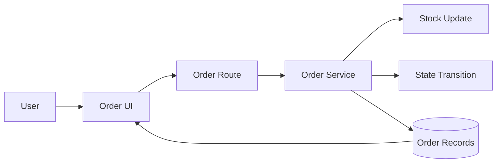
```mermaid
flowchart LR
    User[User] --> UI[Order UI]
    UI --> API[Order Route]
    API --> Service[Order Service]
    Service --> Inventory[Stock Update]
    Service --> Status[State Transition]
    Service --> DB[(Order Records)]
    DB --> UI
```

---

## 16. Module Interaction Diagrams

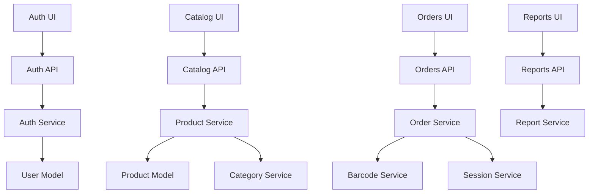
```mermaid
flowchart TB
    AuthUI[Auth UI] --> AuthAPI[Auth API]
    AuthAPI --> AuthService[Auth Service]
    AuthService --> UserModel[User Model]

    CatalogUI[Catalog UI] --> CatalogAPI[Catalog API]
    CatalogAPI --> ProductService[Product Service]
    ProductService --> ProductModel[Product Model]
    ProductService --> CategoryService[Category Service]

    OrdersUI[Orders UI] --> OrdersAPI[Orders API]
    OrdersAPI --> OrderService[Order Service]
    OrderService --> BarcodeService[Barcode Service]
    OrderService --> SessionService[Session Service]

    ReportsUI[Reports UI] --> ReportsAPI[Reports API]
    ReportsAPI --> ReportService[Report Service]
```

---

## 17. Folder Dependency Tree

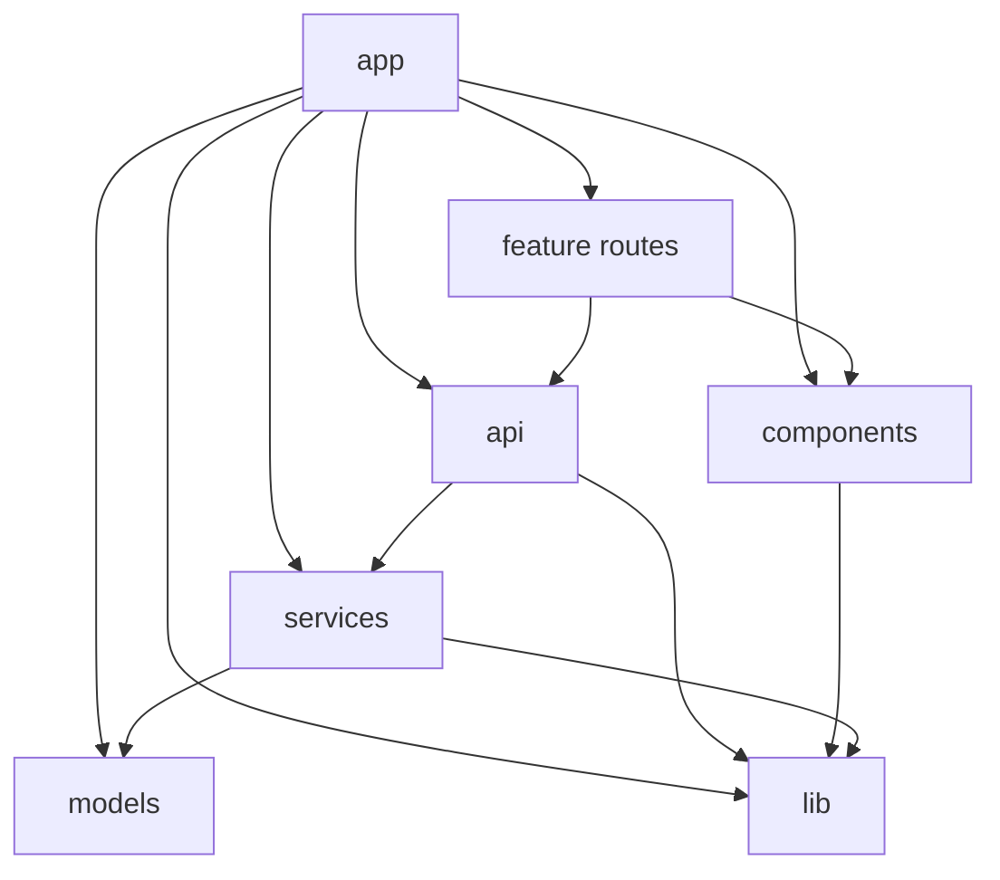
```mermaid
flowchart TD
    app[app]
    app --> api[api]
    app --> components[components]
    app --> lib[lib]
    app --> models[models]
    app --> services[services]
    app --> routes[feature routes]

    api --> services
    api --> lib

    components --> lib
    services --> models
    services --> lib
    routes --> components
    routes --> api
```

---

## 18. Business Workflows

### A. User onboarding and authentication
1. The user signs up or logs in.
2. The system creates or validates a user identity.
3. An auth cookie is issued.
4. The user enters the secured application shell.

### B. Product catalog management
1. A user creates or edits a product.
2. The system validates the payload.
3. The product is persisted and associated with a category.
4. Barcode and inventory state are synchronized.
5. The product becomes visible in the catalog and reporting surface.

### C. Order handling
1. An order is created from a draft or POS interaction.
2. The order enters a pending or approval state.
3. The owner approves it.
4. Inventory changes and barcode state transitions occur.
5. The order becomes completed or canceled.

### D. Returns and reversals
1. A return request is submitted.
2. The system restores stock and updates barcode state.
3. The return record is persisted.
4. Reporting reflects the reversal.

### E. Session-driven billing
1. A session is created.
2. Participants join via a session identifier.
3. Barcodes are added to a shared cart.
4. The session completes or is canceled.

---

## 19. State Diagrams

### Order state model
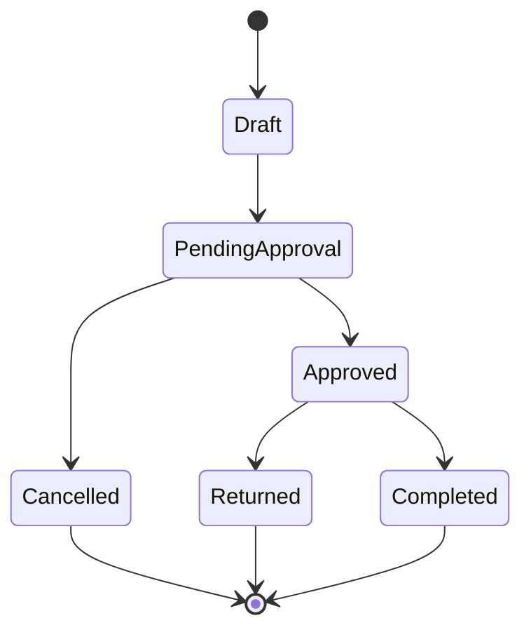
```mermaid
stateDiagram-v2
    [*] --> Draft
    Draft --> PendingApproval
    PendingApproval --> Approved
    PendingApproval --> Cancelled
    Approved --> Completed
    Approved --> Returned
    Cancelled --> [*]
    Returned --> [*]
    Completed --> [*]
```

### Session state model
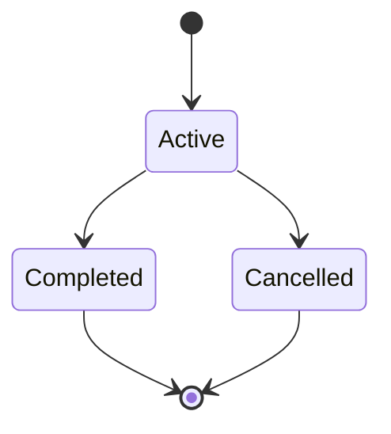
```mermaid
stateDiagram-v2
    [*] --> Active
    Active --> Completed
    Active --> Cancelled
    Completed --> [*]
    Cancelled --> [*]
```

### Barcode state model
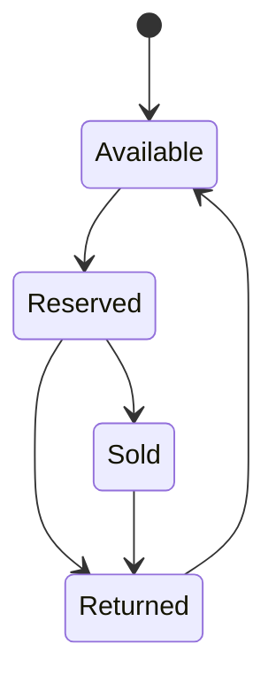
```mermaid
stateDiagram-v2
    [*] --> Available
    Available --> Reserved
    Reserved --> Sold
    Reserved --> Returned
    Sold --> Returned
    Returned --> Available
```

---

## 20. Risks and Bottlenecks

### Architectural risks
- Business rules are concentrated in a few large service modules.
- Some route handlers still bypass the ideal service boundary.
- Authentication and authorization are functional but could be more explicit and policy-driven.
- Large UI screens may become difficult to evolve and test.

### Operational bottlenecks
- Inventory and order transactions are sensitive and need careful consistency handling.
- Heavy reporting and analytics on large datasets may become slow if implemented in application code rather than aggregation pipelines.
- In-memory rate limiting and simple auth helpers are fine for development but not sufficient for public-scale abuse prevention.

### Maintainability risks
- The codebase is good for a product in early growth, but as the product scales, decomposition and standardization will matter more.

---

## 21. Scalability Analysis

### Current scalability posture
The architecture is well-suited for a small-to-medium SaaS product with a single application instance and shared MongoDB persistence.

### Scalability strengths
- Stateless request handling
- Service-oriented modular design
- MongoDB-friendly document model
- Clear separation of UI and server layers

### Scalability constraints
- Authentication and rate-limiting are currently lightweight and local.
- Large analytics workloads may need aggregation and caching strategies.
- The current model may need stronger transaction safeguards for high-volume order activity.

### Recommended scaling path
1. Introduce a more formal service boundary and domain modules.
2. Add caching around dashboard and settings reads.
3. Move reporting to aggregation-heavy queries and indexes.
4. Introduce distributed rate limiting and audit logging.
5. Prepare for horizontal scaling by avoiding server-local state.

---

## 22. Security Architecture

### Security principles in the current system
- Authentication is cookie-based and backed by signed JWTs.
- Password hashing uses a strong one-way function.
- Middleware restricts access to protected routes.
- Sensitive operations are routed through server-side services.

### Security improvement areas
- Remove any fallback secret usage in production.
- Ensure all write routes consistently validate and authorize requests.
- Introduce stronger role and policy enforcement.
- Add structured logging and security audit events.
- Replace in-memory rate limiting with a shared throttling mechanism for public-facing deployments.

### Security architecture view
```mermaid
flowchart TD
    Client --> Middleware[Route Protection]
    Middleware --> API[Validated API Layer]
    API --> Services[Business Logic]
    Services --> DB[(Data Store)]
    Services --> Audit[Audit / Logging]
```

---

## 23. Performance Architecture

### Performance characteristics
The application is designed to be responsive and straightforward, with most operations centered around a small number of server round trips.

### Potential performance concerns
- Some reporting and catalog analytics may become slower as data volume grows.
- Large UI screens with complex local state can become expensive to render and maintain.
- Barcode and inventory flows should remain efficient and transaction-safe.

### Performance architecture recommendations
- Use aggregation pipelines for analytics.
- Add caching for read-heavy views.
- Optimize key indexes on product, order, barcode, and session query paths.
- Break large pages into smaller components and data boundaries.

---

## 24. Suggested Refactoring Architecture

The next step should be a modernization pass that improves clarity and resilience without changing the product’s core purpose.

### Recommended target architecture
```mermaid
flowchart TB
    subgraph Presentation
        FeaturePages[Feature Pages]
        FeatureHooks[Feature Hooks]
        PresentationalComponents[Presentational Components]
    end

    subgraph API
        Controllers[Controllers / Route Adapters]
        Policies[Authorization Policies]
    end

    subgraph Domain
        InventoryDomain[Inventory Domain]
        OrderDomain[Order Domain]
        SessionDomain[Session Domain]
        ReportingDomain[Reporting Domain]
    end

    subgraph Data
        Repositories[Repositories / Data Access]
        MongoDB[(MongoDB)]
    end

    FeaturePages --> Controllers
    Controllers --> Policies
    Policies --> InventoryDomain
    Policies --> OrderDomain
    Policies --> SessionDomain
    InventoryDomain --> Repositories
    OrderDomain --> Repositories
    SessionDomain --> Repositories
    ReportingDomain --> Repositories
    Repositories --> MongoDB
```

### Refactoring objectives
- Reduce coupling between UI pages and backend logic.
- Standardize route handlers around shared controller patterns.
- Move more business rules into clear domain modules.
- Introduce explicit policy-based authorization.
- Improve testing around critical flows such as order approval and inventory mutation.

### Priority refactoring areas
1. Authentication and secret handling
2. Order and inventory workflow boundaries
3. Large UI pages and scanner components
4. Analytics and reporting queries
5. Shared validation and error handling

---

## Architectural Summary

This codebase is a practical and well-structured inventory SaaS application with a clear layered architecture. Its strengths are its modularity at the folder level, its service-oriented business logic, and its straightforward route-to-service-to-database flow.

Its main architectural opportunities are to:
- strengthen security boundaries,
- formalize authorization policies,
- reduce the size of major UI screens,
- and make the service and API boundaries more consistent as the product evolves.

In its current form, the application is a solid foundation for a focused inventory product. With disciplined refactoring, it can mature into a more scalable and maintainable SaaS platform.
